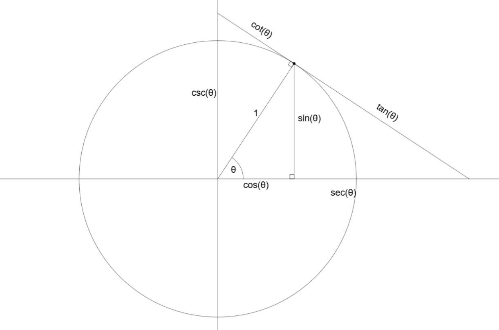

# Interactive-Trig-Unit-Circle-Diagram
Click and drag the point on the unit circle to visualize the trig values sine, cosine, tangent, secant, cosecant and cotangent

> Click the image above to try it live on GitHub Pages.
